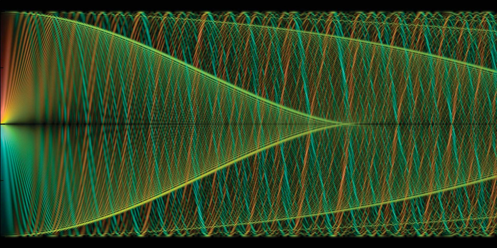

Electron Waves in a Magnetic Field
==================================

Calculate and visualize charged particle-waves in a uniform magnetic field, using the exact quantum solution and the semiclassical approximation based on particle trajectories.

### Overview

Although the descriptions seem incompatible at first glance, there is a deep connection between particle motion (an object following a defined path through space in time), and wave propagation (a spreading "disturbance" in some "field" that extends through space).  In quantum mechanics, objects ("particle-waves") are represented by a spreading wave function, but it is often easiest to understand the propagation of this wave in terms of classical particle motion.  

Semiclassical models construct approximated solutions to wave propagation problems by examining trajectories that guide the wave.  (You can learn more about the idea on my [webpage](http://www.christianbracher.net/research-interests.html), which also has links to accessible [talks](http://www.christianbracher.net/general-audiences.html) on the subject.)  An interesting twist is that there are often many such trajectories that the wave will follow simultaneously, with the resulting wave amplitude enhanced or suppressed by interference.  (The famous [double slit experiment](http://en.wikipedia.org/wiki/Double-slit_experiment) represents the canonical example.)

The complexity of the method depends on the exact setup.  For an electron wave moving in a homogeneous magnetic field, there is an infinitude of corresponding paths (cyclotron motion), rendering the semiclassical model a mathematically and computationally challenging approach.  I wrote the code in this repository to address this problem.  The results have been published in the journal *Physical Review A* (2012).  This article, which is included in this repository, contains many plots based on the modules collected here.

### Contents of the repository

##### C++ code

Contains modules to calculate particle density and current in the electron wave:

*  *Density and Current Profiles.cpp*: Calculate a radial profile of electron density or current in the wave, based on the semiclassical, uniform, or exact quantum methods.

*  *Quantum Cross Section.cpp*: Graph the density or current distribution in a plane perpendicular to the magnetic field, using the exact quantum solution.

*  *Quantum Current Map.cpp*: Same, but plot the quantum solution for density and current in a plane containing the magnetic field axis.

*  *Semiclassical Current.cpp*, *Semiclassical Density.cpp*: Plot the semiclassical approximation to the electron density or current in a plane containing the magnetic field axis.

##### Publication

PDF file of a publication on this problem, including many plots generated by these codes.  One of the figures in the paper (Figure 16) was chosen as Phyical Review A [*Image of the Month*](http://pra.aps.org/kaleidoscope/pra/86/2/022715), and also featured in the 2013 *American Physical Society* wall calendar.

### Visualization approach

The motion of electron waves in a magnetic field is a problem that is simple to state, but yields results of surprising complexity.  To meet the challenge of capturing all this detail in visual form, I developed a format that uses both brightness (as a level of intensity) and color hue (as an indicator of direction, akin to the color wheel) to display the flow of the electrons.  A low-level rendering method (implemented in C++) calculates the properties of the electron wave pixel-by-pixel and encodes the resulting image in bitmap format.

##### Further steps

The code is working, but should ideally be refactored to reduce complexity and redundancy:
* Combine programs that simulate semiclassical density and current maps, and quantum maps.  
  (This is already done for the code creating radial profiles.)
* Modularize the code more - different project codes often define the same functions and use the same concepts.
* Create command line or script options so the code does not have to be changed each time a simulation is run.
